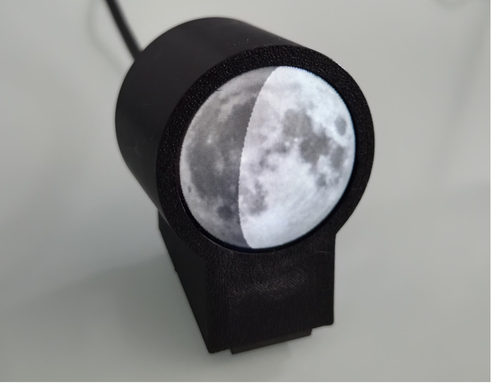

# Moon Display
The Moon Display is a compact desk device built around an ESP32-C3 and a round IPS display that shows the current view of the Moon in real time: not just the phase, but the actual appearance as seen from the observer's location at this very moment. Various display options are available, including texture choice, dimming of the unilluminated side, and whether libration is taken into account.
An internet connection is only needed as a time source — all astronomical calculations are performed on the device itself.



## Features
* Real-time moon rendering showing the current appearance as seen from the observer's location
* Accurate moon phase, libration, and axial tilt calculation
* Parallax correction based on the observer's geographic position
* All astronomical calculations performed locally on the device using formulas from *"Astronomical Algorithms"* by Jean Meeus
* Time synchronisation via NTP — internet connection only needed as a time source
* Connects to up to 3 configured Wi-Fi networks (automatic selection by signal strength)
* Texture options: high-resolution texture from NASA's CGI Moon Kit or self-taken photograph
* Optional dimming of the unilluminated lunar side
* Optional bluish tint when the moon is below the horizon
* Serial interface (115200 baud) for settings and debug output: Julian date, RA/Dec, azimuth/altitude, libration, phase, parallactic angle, sidereal time, rotation, mask, sunrise/sunset times

## Configuration

### Wi-Fi credentials
Copy `src/credentials.h.template` to `src/credentials.h` and add your networks:

```cpp
#define WIFI_SSID_1     "Network 1"
#define WIFI_PASSWORD_1 "Password 1"

#define WIFI_SSID_2     "Network 2"
#define WIFI_PASSWORD_2 "Password 2"

#define WIFI_SSID_3     ""   // leave empty, if not used
#define WIFI_PASSWORD_3 ""
```

### NTP server
The NTP server and UTC offset are configured in `src/MondPhase.ino`:
```cpp
constexpr char NTP_SERVER[] = "pool.ntp.org";
```

### Runtime configuration via serial interface
All runtime settings are stored in flash (NVS) and survive reboots. Connect at **115200 baud** and use the following commands:

| Command | Description |
|---|---|
| `help` | Show available commands |
| `config` | Show current configuration |
| `set_location <lat> <lon>` | Set observer location in decimal degrees (e.g. `set_location 51.0 9.0`) |
| `set_options <value>` | Set display options as a bitmask (see below) |
| `moon [HH:MM:SS \| DD.MM.YYYY HH:MM:SS]` | Show moon for given time or current time |
| `moon_run` | Start live display (updates every minute) |
| `set_time DD.MM.YYYY HH:MM:SS` | Set system time manually (UTC) |
| `wifi [on\|off]` | Enable or disable Wi-Fi |

**Display options bitmask** (combine with `+`):

| Bit | Value | Description |
|---|---|---|
| 0 | 1 | Darken unilluminated side (earthshine) |
| 1 | 2 | Bluish tint when moon is below horizon |
| 2 | 4 | Use NASA LROC texture instead of photograph |
| 3 | 8 | Apply libration |

Example: `set_options 9` enables earthshine + libration.

## Hardware
* ESP32C3 Super mini
* 1,28 Zoll IPS Display rund (GC9A01)

## Software Requirements
* [VS Code](https://code.visualstudio.com/) with the [pioarduino IDE extension](https://github.com/pioarduino/platform-espressif32)
* The following libraries are fetched automatically by pioarduino:
  * `Adafruit GFX Library`
  * `Adafruit GC9A01A`
  * `SerialCommands`

## Building and Flashing
1. Clone or download this repository and open the folder in VS Code.
2. pioarduino will automatically install the required libraries on first build.
3. Copy `src/credentials.h.template` to `src/credentials.h` and fill in your Wi-Fi credentials.
4. Connect the ESP32-C3 via USB.
5. Click **Upload** in the pioarduino toolbar (or run `platformio run --target upload`) to build and flash the firmware.
6. Use the pioarduino **Serial Monitor** at 115200 baud to view debug output.

